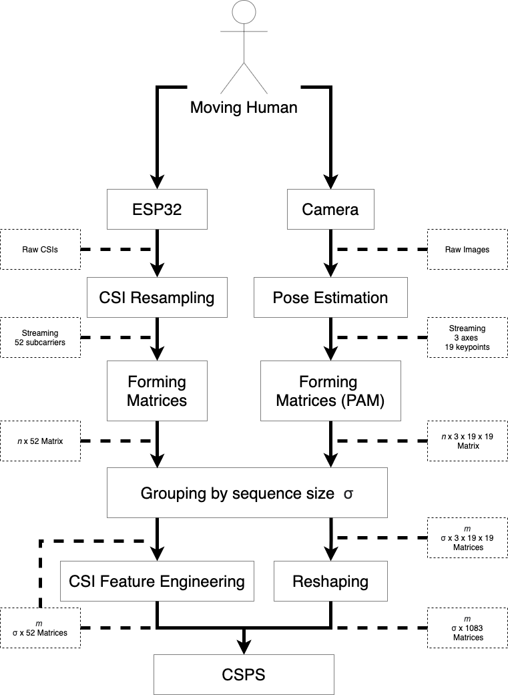

# 3D Moving Human Pose Estimation with WiFi

# Preparation
create a folder "models", and download the [pre-trained model](.......)
 ,then paste into the folder
 
or

create a folder "data", train the model on your own by downloading the [CSI-POSE data](.......)
 ,then paste into the folder 

# How to Train

You can do this only even though you do not have model ./models/\*.pkl but you need to have ./data/\*.csv

**create a folder "models" before training**
>python trainPose3d.py --runTrain=True

# How to Test

You can do this only when you have model file as ./models/*.pkl

>python trainPose3d.py --runTrain=False

## A training method processes

